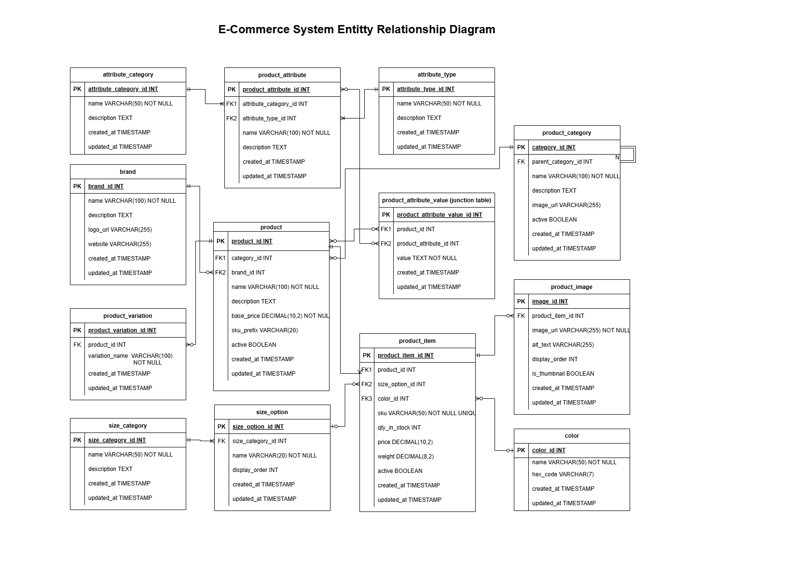

# E-Commerce Database Design

This repository contains a comprehensive SQL database design for an e-commerce platform, including Entity-Relationship Diagrams (ERD) and SQL implementation scripts.

## Project Overview

This database design provides a robust foundation for an e-commerce system, supporting:
- Product management with variations (size, color)
- Category hierarchies
- Brand management
- Flexible product attributes
- Product images

## Database Structure

The database consists of the following main components:

### Core Entities
- **product** - Base product information (name, brand, price)
- **product_item** - Specific purchasable items with variations
- **product_category** - Hierarchical product categorization
- **brand** - Product manufacturer information

### Variation Management
- **color** - Available color options
- **size_category** - Categories of sizes (clothing, shoes, etc.)
- **size_option** - Specific size values
- **product_variation** - Defines variation types for products

### Attribute System
- **attribute_category** - Groups attributes into categories
- **attribute_type** - Defines data types for attributes
- **product_attribute** - Defines specific attributes
- **product_attribute_value** - Junction table linking products to attributes

### Media Management
- **product_image** - Stores image information for product items

## Entity-Relationship Diagram

The ERD visualizes all entities and their relationships:



## Implementation Details

### Database Design Principles

This implementation follows these key principles:
1. **Normalization** - Tables are designed to 3NF to minimize redundancy
2. **Scalability** - Flexible attribute and variation systems support growth
3. **Performance** - Strategic indexing for optimized queries
4. **Data Integrity** - Comprehensive constraints ensure valid data

### SQL Implementation

The database implementation is available in the following SQL scripts:

- `ecommerce.sql` - Complete implementation including tables, relationships, and indexes

The implementation includes:
- Table definitions with appropriate data types
- Primary and foreign key constraints
- Check constraints for data validation
- Unique constraints
- Default values
- Performance-optimized indexes

## Getting Started

### Prerequisites
- MySQL 5.7+ or MariaDB 10.3+

### Installation

1. Clone this repository
   ```
   git clone https://github.com/yourusername/ecommerce-database.git
   ```

2. Connect to your MySQL server
   ```
   mysql -u username -p
   ```

3. Create a new database
   ```sql
   CREATE DATABASE ecommerce;
   USE ecommerce;
   ```

4. Run the SQL script
   ```sql
   SOURCE ecommerce.sql;
   ```

## Project Structure

```
ecommerce-database/
├── docs/
│   ├── e-commerce_erd.png
│   ├── e-commerce_erd.pdf
│   ├── table_analysis.md
│   ├── entity_relationships.md
│   ├── table_attributes.md
│   └── database_constraints.md
├── sql/
│   ├── create_tables.sql
│   ├── add_relationships.sql
│   └── add_indexes.sql
├── ecommerce.sql
└── README.md
```

## License

This project is licensed under the MIT License - see the [LICENSE](LICENSE) file for details.